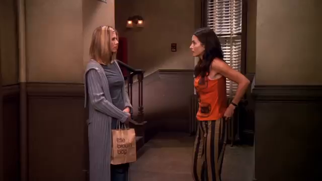
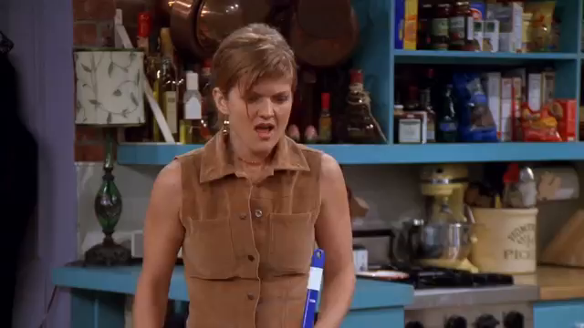
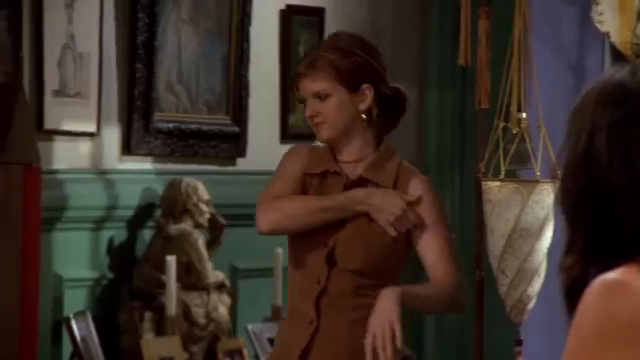
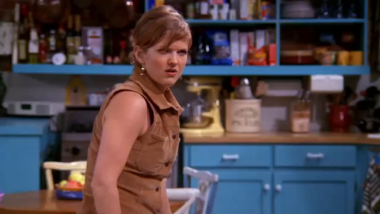
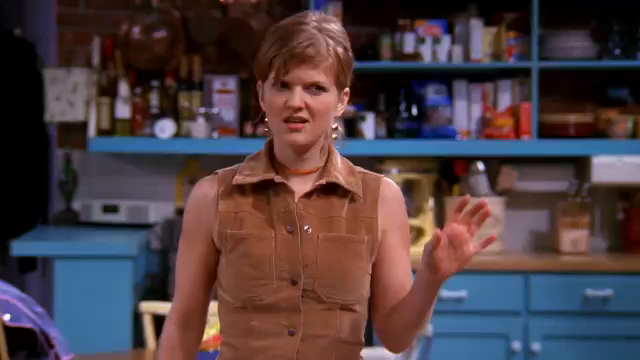
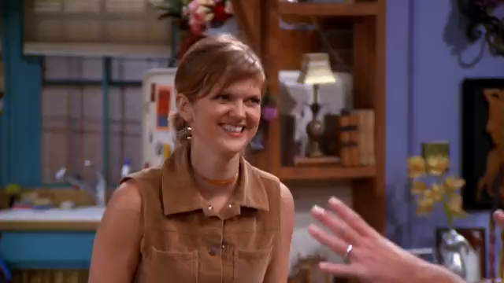

# Video-Google

Looks up for an all the similar image in the the video.

## Some Application

- Locating a particular object across the video
- Finding screen time for an actor or actress
- Figuring out if a particular object is there in the video or not.

### Input

### Output

### Input

### Output

